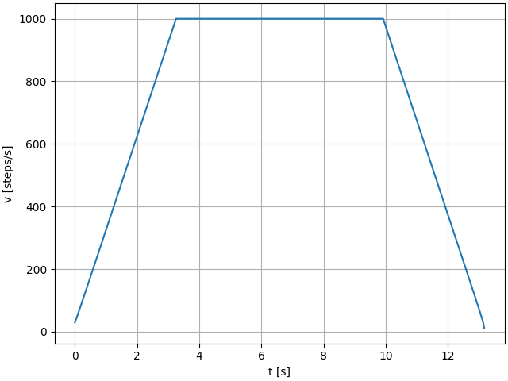

# ramp analysis

When a stepper motor is driven at constant speed directly from standstill, it faces very high torques and inertia which may lead to the loss of steps.  
In order to circumvent step loss when driving the stepper motor, an algorithm is employed which ramps up the speed with constant acceleration, holds the maximum speed and ramps down the speed again before reaching the desired number of steps. An exemplary resulting velocity profile is shown in the graph:  
  
  
The calculations in the python notebook serve as the basis for the development of the c++ code which runs on the raspberry pi and controls the stepper motor driver. In essence, the time between each step is the crucial quantity that is required to follow the velocity profile.